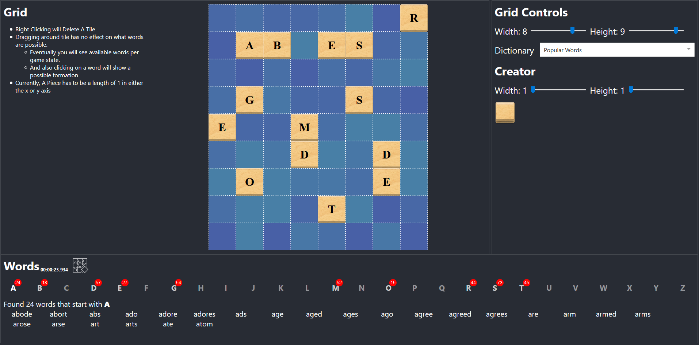

### Hi there 👋

<!--
**will7200/will7200** is a ✨ _special_ ✨ repository because its `README.md` (this file) appears on your GitHub profile.

Here are some ideas to get you started:

- 🔭 I’m currently working on ...
- 🌱 I’m currently learning ...
- 👯 I’m looking to collaborate on ...
- 🤔 I’m looking for help with ...
- 💬 Ask me about ...
- 📫 How to reach me: ...
- 😄 Pronouns: ...
- ⚡ Fun fact: ...
-->

My name is will and I am big advocate for open source projects. Just about every project I have started to is open source.   
I am currently working on a casbin plugin for the jetbrains products stay tuned!

## Latest Web Creation
### Introducing Word Bites Solver [link](https://will7200.github.io/WordBites-Solver/)
I have been enjoying the new game word-bites on game pigeon. They implemented a new feature that gives all the wordsWorker possible on the game that is really cool. The only downside is that is quite expensive to utilize. So i made this app to help with that. There are multiple dictionary that the user can choose from to filter out the words possible.  

